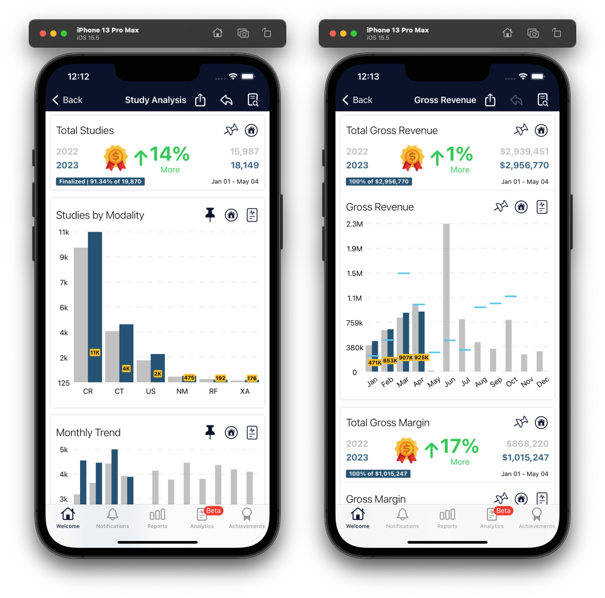

# About DISS Analytics

> Smart Business Intelligence For Your Growth.

     DISS Analytics is a data management application designed and developed by our DISS corporation. The platform works in real time and is designed to turn data into information, giving you the opportunity to make decisions and take actions timely.

With a focus on healthcare and finance, our platform is ideal for management of businesses of operations in these key areas, providing targeted key reports, notifications and summaries with the power of data analytics and artificial intelligence. Whether you're just starting out or have been in business for years, DISS Analytics can make a difference in helping your company grow and differentiate from the competition.

