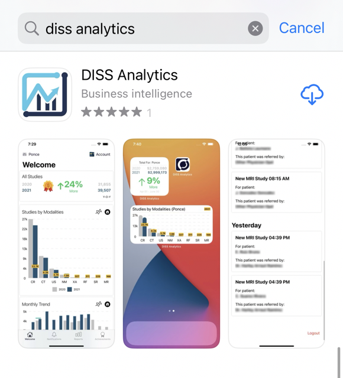
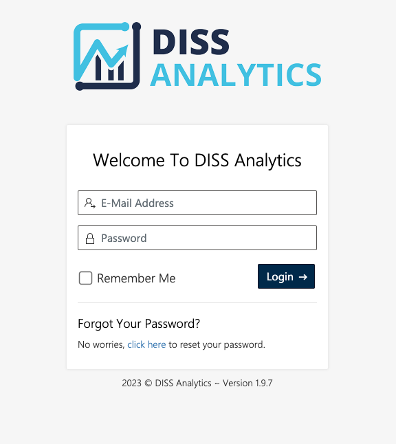

# Getting Started

> Request User and Password in DISS

	DISS Analytics offers two different methods to access its software platform. The first is by downloading the iOS app, which can be found in the App Store. Users simply need an account, and they can begin analyzing their data through the app. 

The second method to access DISS Analytics is through the web version. This is particularly useful for users who prefer to work on a larger screen, or for those who do not have access to an iOS device. Regardless of the method chosen, DISS Analytics offers users a powerful suite of tools to make sense of their data and gain valuable insights.

## iOS App

[Download App in Apple Store, click here.](https://apps.apple.com/us/app/diss-analytics/id1574528276)

Is possible search DISS Analytics in App Store to download.

## Web App

Can be accessed by visiting our website: [dissanalytics.com](https://dissanalytics.com)

